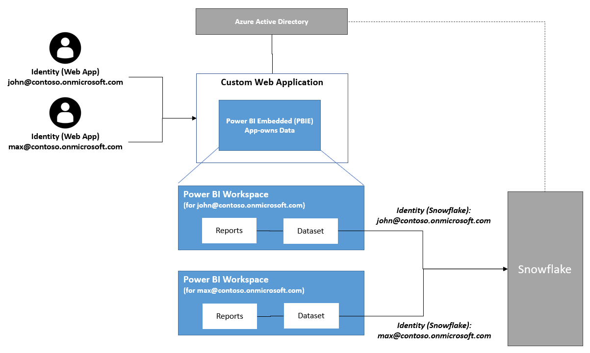

## Power BI Embedded (app-owns data): How to query Snowflake data sources (*DirectQuery* mode) using the actual web user identity.

> *In order to follow this article the reader is expected to understand the basics of Power BI Embedded (PBIE). For anyone new to PBIE it is recommended to start with reading '[What is Power BI embedded analytics?](https://docs.microsoft.com/en-us/power-bi/developer/embedded/embedded-analytics-power-bi)'.*

Do you use Power BI Embedded (PBIE) in an "*Embed for your Customers*" (aka "*app-owns data*") scenario? And, in this context, have you ever asked yourself if it is possible to query Snowflake data using the actual (effective) user identity (using Power BI DirectQuery mode)? If the answers to both questions are '*yes*' then you may want to take some time and read this article.

**Wait .... what is this all about. I need more context.**

Using Power BI's Snowflake connector makes it easy to connect to Snowflake data stores and create reports on top of that data. The underlying data source connection supports authentication using:

- basic credentials (username password combination of a Snowflake user)
- identity provider (IdP) credentials (in combination with OAuth2.0) e.g. an Azure Active Directory (AAD) identity. Interesting to know: Snowflake also provides a guide on how to configure [Power BI SSO to Snowflake](https://docs.snowflake.com/en/user-guide/oauth-powerbi.html).

When using PBIE, does that mean the actual/effective user identity (matching Snowflake user identity) can be used to query Snowflake data? Well, yes and no. If the target PBIE scenario is "*Embed for your Organization*" (aka "*user-owns data*") then, yes, it is possible to transparently map the actual/effective web user identity to the matching Snowflake user identity. For PBIE "*app-owns data*" scenarios, however, the current Snowflake connector doesn't support this mechanism.

Someone may ask "*Is it really relevant what user is used on the Snowflake side?. When using PBIE in an app-owns data scenario, it's the developer's responsibility to take care of user and access control management.*". While this is a fair assessment, it is sometimes required to run Snowflake operations in the context of the specific user. Some examples are: auditing, row level access policies that use `CURRENT_USER()` function, etc.

**Does that mean the actual user identity can't be used when working with Snowflake data sources?**

A workaround is to create a separate connection to the Snowflake data source using the correct Snowflake user credentials. The idea is to create a copy (if PBI *DirectQuery* mode is used) of the Power BI Snowflake dataset and programmatically update the data source credentials. Below is a conceptual overview of this approach; the rest of this article explains key aspects on how to implement it.

Important details of the approach explained in this article

- web user identities are stored in Azure Active Directory (AAD). AAD is the identity provider (IdP).

- Relevant AAD identities (*UPN*) are mapped to Snowflake users (*login_name*). This means `UPN == login_name`

- There is a 1:1 mapping between web users and Power BI Snowflake datasets.

- Oauth2 credentials are used for Snowflake data source (to avoid storing sensitive credential information)

### Implementation details

The details described in this section focus on the required steps to update the credentials (using an oauth token) for a Power BI Snowflake data source. This section doesn't cover additional topics e.g. how to programmatically create and/or copy Power BI artifacts such as workspaces or datasets, configure Snowflake row level access policies, etc.

#### 1. Prepare Azure AD & Snowflake users

As a first step we need to ensure that the users are correctly configured.

Let's assume there is an Azure AD test user `john@contoso.onmicrosoft.com` , then you need to create a matching Snowflake user. Ensure the '*Login Name*' of this new user is `john@contoso.onmicrosoft.com` and it has role '*PUBLIC*' as the default role.

> *It is important that the 'Login Name' is correctly matches the UPN of the Azure AD user. We use these fields to correctly map the users. Also ensure that this user has granted access to test data in Snowflake*

**Detailed instructions**:

Run the statement below in Snowflake.

```sql
CREATE USER johncontoso
    LOGIN_NAME = 'john@contoso.onmicrosoft.com' 
    DEFAULT_ROLE = 'PUBLIC'
```

#### 2. Acquire valid oauth token

In this step we acquire a valid oauth (access) token for the web user that can be used to access the Snowflake data source. In order to successfully update the Snowflake data source credentials, the used oauth token (access token) must meet the following criteria:

1. The token's audience is '*whitelisted*' on Snowflake

1. The token uses a valid Snowflake scope (format: `session:scope:<SNOWFLAKE_ROLE> e.g. session:scope:public`)

   > *The Snowflake role must be assigned to the Snowflake user*

1. The token contains a `upn` claim (relevant to map to the correct Snowflake user)

**Detailed instructions**:

1. Create new Azure AD app registration

   1. Create a new scope `session:scope:public`

1. Verify & acquire access token.

   ```sh
   az login --tenant <AZUREAD_TENANT_ID> --allow-no-subscriptions --scope <AZUREAD_APP_ID>/session:scope:public 
   az account get-access-token --scope <AZUREAD_APP_ID>/session:scope:public
   ```

   The script returns a an encoded access token. Below is an example of a decoded access token with the relevant claims (`aud`, `scp`, `upn`):

    > *To decode an access token e.g. use <https://jwt.io> or <https://jwt.ms> and copy the encoded token `eyJ0eXAiOiJKV1QiLCJhbGciOiJSUzI1N...`*

    ```json
    {
      "aud": "cd6de58e-9090-460c-b0ae-0394c7bd8065",
      ...
      "appid": "968b68e5-2dfc-46f4-bc54-ac04ce9ca9b9",
      "family_name": "",
      "given_name": "John",
      "name": "John",
      ...
      "scp": "session:scope:public",
      ...
      "upn": "john@contoso.onmicrosoft.com",
      "ver": "1.0"
    }
    ```

#### 3. Create Snowflake security integration

In order to map the identity of an oauth (access) token to a Snowflake identity, a Snowflake security entry (for external oauth) is required (for more information see [Snowflake Security Integration - External OAuth](https://docs.snowflake.com/en/sql-reference/sql/create-security-integration-oauth-external.html)). 

**Detailed instructions:**

1. Create a new Snowflake security integration (sample to create security integration named `pbie`):

    ```sql
    create security integration pbie
        type = external_oauth
        enabled = true
        external_oauth_type = azure
        external_oauth_issuer = '<AZURE_AD_ISSUER e.g. https://sts.windows.net/2feff6a0-e23e-47cd-faca-bc993ada3200/>'
        external_oauth_jws_keys_url = 'https://login.windows.net/common/discovery/keys'
        external_oauth_audience_list = ('<TOKEN_AUDIENCE e.g. cd6de58e-9090-460c-b0ae-0394c7bd8065>')
        external_oauth_token_user_mapping_claim = 'upn'
        external_oauth_snowflake_user_mapping_attribute = 'login_name'
        external_oauth_any_role_mode = 'ENABLE';
    ```

    Relevant properties for this scenario: 

    - `external_oauth_issuer`: The Azure AD used to issue the token.
    - `external_oauth_audience_list`: '*Whitelist*' the audience listed in the token (see `aud` claim)
    - `external_oauth_token_user_mapping_claim` & ` external_oauth_snowflake_user_mapping_attribute`: Defines to use the Snowflake user (`login_name`) that maps to the token's `upn` claim


#### 4. Programmatically update the Power BI data source credentials

The Snowflake data connector supports the following credential types:

> *As mentioned in the beginning this article focuses on the oauth2 auth method.*

1. Basic auth

    ```csharp
    var basicCredentials = new BasicCredentials("<SNOWFLAKE_USER>", "<SNOWFLAKE_PASSWORD>");
    ```

2. Oauth2 auth

    ```csharp
    var oauthCredentials = new OAuth2Credentials("<ACCESS_TOKEN>");
    ```

**Detailed instructions**:

The  sample code below updates the data source credentials for the first data source of a specific dataset.

> *CredentialsBase is the base class of the BasicCredentials and the OAuth2Credentials classes*
>
> *If the credentials are invalid (e.g. unauthorized to access Snowflake), the method `UpdateDataSource(..)` throws an `HttpOperationException`. The associated HTTP response contains more details e.g. "The credentials provided for the Snowflake source are invalid."*

```c#
/// <summary>
/// Helper method. 
/// Updates the credentials of a data source
/// </summary>
/// <param name="pbiClient">The PowerBI client executing the operations</param>
/// <param name="newCredentials">New credentials of the data source</param>
/// <param name="workspaceId">Target PBI workspace id</param>
/// <param name="datasetId">Target dataset id</param>
private void UpdataDataSourceCredentials(PowerBIClient pbiClient, CredentialsBase newCredentials, Guid workspaceId, string datasetId)
{
    // ensure that the PBI client identity has the ownership of the dataset
    pbiClient.Datasets.TakeOverInGroup(workspaceId, datasetId);

    // get the data sources of the specified dataset (in our scenario there is only one)
    var datasources = pbiClient.Datasets.GetDatasourcesInGroup(workspaceId, datasetId).Value;
    var datasource = datasources.First();

    // update credentials of the data source
    pbiClient.Gateways.UpdateDatasource(datasource.GatewayId.Value, datasource.DatasourceId.Value, new UpdateDatasourceRequest()
    {
        CredentialDetails = new CredentialDetails(newCredentials, PrivacyLevel.None, EncryptedConnection.Encrypted)
    });
}
```

### Additional resources

TODO