<!--
title: "Accelerate Gemini Enterprise Agent Development & Troubleshooting with Local Tunneling"
author: "Oliver Lintner"
date: 2026-02-16
-->

# Accelerate Gemini Enterprise Agent Development & Troubleshooting with Local Tunneling

If you find yourself in the image below, then you may want to read this article.

> *This image was generated with AI (model: gemini-3-pro-image-preview)*
 
[Gemini Enterprise](https://cloud.google.com/gemini-enterprise) is a powerful platform that allows organizations to deploy and manage custom AI agents that can perform complex tasks, search proprietary data, and integrate with internal systems. This extensibility empowers developers and architects to create and register their own agents to tailor Gemini Enterprise to their unique operational workflows.

Building enterprise-grade AI agents and use them via Gemini Enterprise can sometimes be a difficult "deploy-and-pray" cycle (like in any other “integration” scenario). You write code, containerize it, deploy it to the cloud, and then comb through logs to find out why an agent call failed. 

This article explores a high-velocity alternative: developing and debugging A2A-enabled agents locally using a public tunnel.

## The Basics

### What is an A2A Agent?

An A2A agent is essentially a web service that implements the [Agent-to-Agent (A2A) Protocol](https://a2a-protocol.org/latest/). It allows Gemini Enterprise (the *"Client"*) to communicate with your custom backend (the *"Server"*) using a standardized messaging format. This protocol handles tool discovery, conversation turns, and state management, enabling your agent to act as a specialized collaborator within Gemini Enterprise.

### What is a Tunnel (and why not a standard Reverse Proxy)?

In networking, a tunnel is a secure, encapsulated pathway that allows data to travel between two points—in this case, from the public internet directly to your local machine.

While a *"standard"* reverse proxy also routes traffic to backends, it typically requires that the server hosting the proxy has a direct, reachable path to the backend. For local development, this, in many cases, presents two major hurdles:

- **Firewall Restrictions**: Standard proxies require you to open an "inbound" port on your local router or firewall to allow the proxy to reach your machine.

- **NAT Complexity**: Most local machines sit behind Network Address Translation (NAT), making them difficult to address from the outside world without complex port forwarding.

But there are also services like, [ngrok](https://ngrok.com/). These use a different approach by using an outbound-initiated connection. E.g. the ngrok agent on your local machine "calls out" to a cloud instance, establishing a persistent tunnel. Because your machine initiated the connection, your firewall typically allows it, and the tunnel can then "carry" inbound requests from external sources (e.g. Gemini Enterprise) back to your local machine without you ever having to touch a firewall setting or router configuration.

### The Development Bottleneck

Typically, to test an A2A agent with Gemini Enterprise, you must host it on a public endpoint (e.g., [Google Cloud Run](https://cloud.google.com/run), [Vertex AI Agent Engine](https://docs.cloud.google.com/agent-builder/agent-engine/overview)). This creates a significant barrier to developer velocity:

- **Iterative Slowness**: Every minor change requires a redeploy to the cloud.

- **Visibility Gaps**: Debugging relies heavily on structured logging or remote tracing rather than a live debugger.

- **Troubleshooting Friction**: Issues with payload formatting or Gemini Enterprise interaction.

## The Idea: Bridging the Gap with a Tunnel

Since an A2A agent is essentially a Web API (e.g. built using [Google Agent Development Kit (ADK)](https://google.github.io/adk-docs/) and FastAPI), there is no technical reason it must run in the cloud during development. We can bridge the gap between your local machine and Gemini Enterprise using a tunnel.

### The Architecture

Instead of deploying to a cloud environment, you run your agent locally on a port (e.g., 8080). By using a tunnel service tool (like ngrok), you create a temporary, secure public URL that forwards traffic to your local port. Conceptually the setup will then look like this:

```mermaid
architecture-beta
    group ext(logos:google-cloud)[External_Internet]
    group lm(server)[Local]

    service ge(internet)[Gemini_Enterprise] in ext
    service ptnl(internet)[Tunnel_Service_Public] in ext
    service lcl(server)[Dev_Env] in lm
    service agent(internet)[A2A_Agent] in lm
    service ltnl(internet)[Tunnel_Service_Local] in lm

    ge:R -- L:ptnl
    lcl:B -- T:agent
    ltnl:R -- L:agent
    ptnl:R -- L:ltnl
```

### Step-by-Step Workflow

> **Important**: *For this local tunneling setup to function, the agent must be configured as an A2A (Agent-to-Agent) agent. This ensures that Gemini Enterprise communicates via standardized web requests that can be forwarded through the tunnel.*

1. **Develop Locally**: Use a framework like the Google ADK to build your agent logic. Ensure the agent is A2A compliant.

1. **Start the Tunnel**: E.g. if you use ngrok you can run `ngrok http 8080 --host-header="localhost:8080"`. You will receive a URL like *https://random-id.ngrok-free.dev*.
   > **Note**: *Rewriting the host header is critical for local development. Many web frameworks and network configurations rely on the Host header to route requests correctly; without this flag, the local server might reject the tunneled traffic.*

1. **Register the A2A Agent (using the Agent Card)**: In the Gemini Enterprise Admin Panel, register a new *"Custom agent via A2A"*.

   You will also be asked to provide an Agent Card (a JSON document describing your agent). Ensure the url field inside the Agent Card JSON is also set to your publicly URL (e.g., "url": "https://random-id.ngrok-free.dev").

1. **Live Debugging**: Set a breakpoint in your IDE. When you interact with the agent in the Gemini Enterprise UI, the request will hit your local machine, allowing you to inspect variables, step through tool execution, and modify code in real-time.

This approach transforms the debugging experience from *"guessing via logs"* to *"stepping through code."*

## Closing: Flexibility and Future-Proofing

To be very crystal clear: the approached described in this document isn't a replacement for a sound CI/CD setup. But when developing (or demo purposes) *velocity* is key - and rapid feedback and simplified testing (and troubleshooting) is very important. And before replicating this approach you must be aware of security and license implications of the tools in use. That said, the described *"Tunnel-to-A2A"* approach drastically reduces the development cycle time and simplifies troubleshooting the complex handshakes between Gemini Enterprise and your custom tools.

Beyond basic debugging, this setup enables advanced local scenarios:

- **MCP Integration**: You can integrate your A2A agent with Model Context Protocol (MCP) servers running locally on the same machine via stdio. This is perfect for demoing agents that need to access local files, databases, or terminal environments without ever leaving your development workstation.

- **Rapid UI Testing**: Instantly see how Gemini Enterprise renders your agent's responses or tool results without waiting for CI/CD pipelines.

By moving the "cloud boundary" to your local terminal, you can focus on building intelligent agentic logic rather than fighting deployment infrastructure.

*For sample implementation code and boilerplate for A2A agents, check out [this GitHub repository](https://github.com/se02035/google-ws-agent).*
